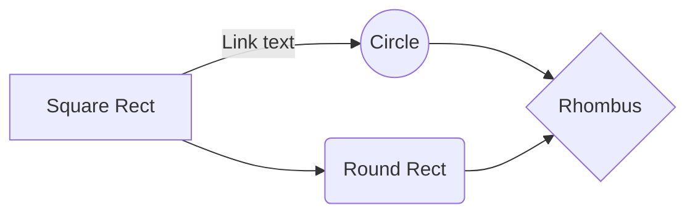

# Lorem ipsum

## What is Lorem Ipsum?

Hello!

**Lorem Ipsum**  is simply dummy text of the printing and typesetting industry.   *Lorem Ipsum has been the industry's standard dummy text ever since the 1500s, when an unknown printer took a galley of type and scrambled it to make a type specimen book.*

We use [GitHub](https://github.com/) site, and his name is  **Octcat**😉 


> I love  `Code` !

```js
let a = 1;
let b = 2;
let c = a + b;
console.log(c);
```

- First item
- Second item
- Third item

1.  First ordered list item
2.  Another item
3.  Another item

---

## GitHub Flavored Markdown

<details>
<summary>Tips for collapsed sections</summary>

### You can add a header

You can add text within a collapsed section. 

You can add an image or a code block, too.

```js
 console.log("Hello World");
```
---

</details>

| Tables        |      Are      |   Cool |
| ------------- | :-----------: | -----: |
| col 3 is      | right-aligned | \$1600 |
| col 2 is      |    centered   |   \$12 |
| zebra stripes |    are neat   |    \$1 |

#### MathJax

The *Gamma function* satisfying $\Gamma(n) = (n-1)!\quad\forall n\in\mathbb N$ is via the Euler integral

$$
\Gamma(z) = \int_0^\infty t^{z-1}e^{-t}dt\,.
$$

#### Mermaid

